# QuantQueens Agent Safety Middleware

QuantQueens is runtime middleware for governing AI Agents before they affect
protected resources. It connects identity, exact permissions, dependency-graph
impact, trusted Run history, approvals, circuit breaking, execution, and audit
evidence in one enforced path.

```text
MODEL -> PROPOSE -> IDENTIFY -> AUTHORIZE -> MAP IMPACT -> ASSESS RISK
      -> ALLOW / PAUSE / BLOCK -> EXECUTE -> OBSERVE -> UPDATE BASELINE
```

The graph is not only a visualization, and the timeline is not only logging.
Both participate in runtime decisions. An Agent may have permission to change
a configuration and still be paused because that configuration reaches a
production service, sensitive customer data, or behavior outside the Agent's
trusted history.

## What it solves

Conventional Agent platforms often know that an Agent called a tool, but not
the full operational meaning of the action. Static RBAC answers whether an
Agent has a direct permission; it does not answer what the resource affects,
whether the request is normal for this Agent, or whether the effect actually
happened.

QuantQueens closes those gaps:

| Common problem | QuantQueens response |
| --- | --- |
| A valid permission can still cause widespread damage | Traverse downstream dependencies and sensitive data before execution, then calculate an explainable Blast Radius. |
| Logs explain an incident only after the effect | Enforce identity, authorization, graph risk, history, and breaker state before the protected adapter runs. |
| A static graph quickly becomes stale | Capture Run-backed relationship observations from prompts and Agent output, quarantine them for review, then use confirmed relationships as future risk context. |
| Risk scores are difficult to trust | Persist the exact resources, paths, historical differences, thresholds, reason codes, and final effect outcome behind every decision. |
| Delegated Agents may silently gain privilege | Preserve the origin user and Run, parent and child Agents, delegation chain, and the intersection of effective capabilities. |
| An approval may be reused after context changes | Bind approvals to the exact request, graph revision, action hash, expiry, and one-time execution claim. |
| Repeated risky behavior continues unchecked | Persist circuit-breaker state and stop protected effects when the configured threshold is crossed. |

## Benefits

- **Safer execution:** denied, blocked, tripped, and unapproved actions return
  before the managed resource adapter can change state.
- **Operational context:** the graph reveals indirect impact that is invisible
  in a flat permission list.
- **Clear accountability:** every protected action is attributed to a principal,
  Agent, Run, resource, decision, and effect.
- **Explainable intervention:** users can see why an action was allowed, paused,
  or blocked in plain language and inspect the supporting graph path.
- **Controlled recovery:** unusual but authorized actions can pause for a bound
  human approval and continue through the same Run without bypassing policy.
- **Compounding value:** trusted completed Runs update a bounded behavioral
  baseline, so future decisions can distinguish routine behavior from novelty.
- **Auditable evidence:** immutable, sequence-ordered Run events reconstruct
  what happened without pretending to deterministically re-execute an external
  side effect.

## Run locally with Docker Compose

### Requirements

- Docker Desktop, Docker Engine, or Colima with Docker Compose
- A Volcengine Ark API key
- A Responses-compatible Ark endpoint or model ID

Node.js is required only for source development and automated tests. The Docker
image contains the Codex CLI used by live Agent Runs.

### 1. Create the local configuration

From the repository root:

```bash
./scripts/bootstrap-local.sh
```

Open the generated, ignored `.env` and set:

```dotenv
ARK_API_KEY=your-real-ark-api-key
ARK_MODEL=your-responses-capable-endpoint-id
APP_AUTH_TOKEN=replace-with-at-least-24-random-characters
```

Keep these values local. Never commit `.env`, runtime databases, workspaces, or
Codex session data.

### 2. Start the application

```bash
docker compose up --build -d
docker compose ps
```

Wait until `launchpad` reports healthy, then open
<http://127.0.0.1:3000>. Enter the same `APP_AUTH_TOKEN` when prompted.

Follow startup or Agent Runtime output with:

```bash
docker compose logs -f launchpad
```

Stop the stack while preserving its data:

```bash
docker compose down
```

After changing source code, rebuild the running application:

```bash
docker compose up --build -d --force-recreate
```

## Try the core flow

The complete three-minute presenter sequence, exact prompts, expected screens,
timing, refresh behavior, and speaking notes are in [script.md](script.md).

The shortest useful walkthrough is:

1. Open **Release Guardian** and select **Playground**.
2. Submit `Update the staging configuration to release 2.4.1.`
3. Open **Request journey** and verify **Allowed / Allowed / Completed**. This
   action passed through the Resource Gateway and changed managed SQLite state.
4. Submit `Read Bob's private records.`
5. Verify **Denied / Not needed / Prevented**. No execution claim was issued and
   no adapter effect occurred.
6. Select **View audit trail** to inspect ordered identity, authorization,
   resource, risk, and terminal events.
7. Open **Impact map** and focus the path from the Agent through deployment
   configuration and production service to the customer dataset.

To show the graph learning from Agent work:

1. Create an Agent named **Dependency Scout**.
2. Give it the instruction `Describe technical relationships precisely. Never
   infer permission from topology.`
3. Submit:

   ```text
   Map these dependencies in two plain sentences: Checkout API -> Fraud Service -> Customer records. Use the verbs calls and processes.
   ```

4. Wait for the real Agent Run to complete. The middleware extracts `CALLS` and
   `PROCESSES` observations from the response and stores their Run provenance.
5. Open **Network graph** or select **Show pending network**. If needed, select
   **Refresh network** once after the Run completes.
6. Review the dashed pending relationships. They are visible evidence but are
   quarantined from policy until a human confirms them, and they can never
   create a `CAN_*` permission.

## How it works

### Runtime path

```mermaid
flowchart LR
    User[Human operator] --> UI[React UI]
    UI --> API[Fastify API]
    API --> Run[AgentService creates Run]
    Run --> Gate{{Whole-Run policy gate}}
    Gate --> Planner[Codex read-only planner]
    Planner --> Proposal[Validated bounded proposal]
    Proposal --> Gateway{{Resource Gateway}}

    Gateway --> Identity[Server-attested identity<br/>Run + Agent + delegation]
    Identity --> Auth[RBAC + exact CAN_* capability]
    Auth --> Graph[Forward and reverse graph impact]
    Graph --> History[Trusted behavioral baseline]
    History --> Risk{{ALLOW / WARN / BLOCK<br/>circuit breaker}}

    Risk -->|ALLOW or approved WARN| Claim[Atomic one-time claim]
    Claim --> Adapter[Managed resource adapter]
    Adapter --> Effect[(Managed SQLite state)]
    Risk -->|DENY, BLOCK, or unapproved WARN| Prevent[No adapter effect]

    Identity -.-> Events[(Ordered Run events)]
    Auth -.-> Events
    Graph -.-> Events
    Risk -.-> Events
    Adapter -.-> Events
    Prevent -.-> Events
    Events --> Learn[Trusted observations and baseline update]
    Learn --> History
```



The browser and the model submit intent; they do not submit trusted identity,
permissions, risk scores, graph paths, or verdicts. Those facts are resolved on
the server from durable state.

### Enforcement stages

1. **Create an attributable Run.** The server binds the configured origin
   principal, Agent, Run, and delegation context.
2. **Constrain protected planning.** When a prompt names a managed Resource,
   Codex runs as a read-only planner and may return one bounded action proposal.
3. **Validate the proposal.** The server resolves the resource and capability
   against the current managed catalog. Model output cannot grant permission.
4. **Authorize exactly.** RBAC, ownership rules, Agent lifecycle, direct
   `CAN_*` capability, Run ownership, and delegated scope must all agree.
5. **Calculate impact.** Bounded, cycle-safe traversal finds reachable resources,
   sensitive downstream systems, reverse dependencies, and the evidence path.
6. **Compare history.** The risk evaluator compares the action with a frozen,
   trusted baseline of completed mediated Runs.
7. **Enforce the result.** `ALLOW` can proceed, `WARN` pauses for approval, and
   `BLOCK` or `TRIPPED` returns before the adapter.
8. **Claim and execute once.** An approved request receives an atomic claim
   bound to the action hash, graph revision, resource, capability, and payload.
   The adapter rechecks that authority inside the effect transaction.
9. **Record the outcome.** The timeline persists whether the resource was
   touched, prevented, failed, or completed.
10. **Update future context.** Only eligible trusted outcomes enter the normal
    behavioral baseline. Denials and unsafe attempts cannot teach the system
    that dangerous behavior is normal.

## The knowledge graph

The graph models operational relationships, not only access-control JSON.

### Nodes

- `human`: accountable origin or resource owner
- `agent`: stable Agent identity
- `asset`: configuration, service, API, file-like managed resource, or other
  operational target
- `data_category`: data reached or processed by a system
- `run`: execution provenance where applicable

### Relationships

- **Authority:** `CAN_READ`, `CAN_WRITE`, `CAN_CALL`, `CAN_USE`
- **Topology:** `DEPLOYS_TO`, `PROCESSES`, `CONTAINS`
- **Accountability:** `OWNS`
- **Runtime evidence:** `ATTEMPTED`, `TOUCHED`, `DENIED`
- **Observed topology:** relationships such as `CALLS` and `PROCESSES`, stored
  with evidence, confidence, source Run, and review state

Only an explicit authorized `CAN_*` edge can contribute authority. Ownership,
proximity, inferred topology, historical success, and observed relationships
provide context but never permission.

The backend exposes reusable forward and reverse queries that answer questions
such as:

- What can this Agent directly and transitively affect?
- Which sensitive resources are downstream of this action?
- Which Agents and Runs could affect a selected resource?
- What is the shortest evidence path behind the Blast Radius?
- Which resources changed during a Run?
- Which relationship was declared, observed, confirmed, rejected, or executed?

Runtime policy consumes these queries before protected execution. The Impact
map and Network graph are projections of the same backend truth.

## Risk with consequences

Authorization and contextual safety are separate decisions:

| Result | Runtime consequence |
| --- | --- |
| `DENY` | Stop before graph risk can grant anything; issue no execution claim. |
| `ALLOW` | Continue only if the circuit breaker and adapter rechecks also pass. |
| `WARN` | Pause with managed state unchanged until a valid bound approval is consumed. |
| `BLOCK` | Prevent the action and, when configured, transition the persistent breaker to `TRIPPED`. |
| `TRIPPED` | Reject covered actions until an authorized, audited reset reopens evaluation. |

Blast Radius is derived from reachable graph state, classification, resource
criticality, and sensitive downstream paths. Historical novelty can increase
risk without changing the Agent's direct permission. The UI therefore presents
three distinct answers:

1. **Permission:** may this Agent access the target?
2. **Safety:** is the authorized action acceptable in its current graph and
   historical context?
3. **Resource effect:** did the managed adapter actually perform the action?

## Learning and adaptation

QuantQueens uses deterministic, explainable adaptation instead of an opaque
model-labelled risk score.

- The latest bounded window of trusted completed Runs produces a versioned
  baseline of normal resources, actions, impact, and delegation depth.
- A future action is compared with the frozen baseline used for that decision.
- Completed safe or explicitly accepted effects may update the next baseline.
- Denied, blocked, failed, and quarantined activity remains negative evidence
  and cannot expand the trusted-normal set.
- Prompts and final Agent responses may produce relationship observations with
  evidence and confidence.
- New observations are quarantined from traversal until reviewed, and none can
  create authority.

This produces the feedback loop:

```text
RUN -> ORDERED EVENTS -> OBSERVATIONS -> REVIEW / TRUST FILTER
    -> UPDATED GRAPH OR BASELINE -> STRONGER FUTURE DECISION
```

## Flight recorder and explainability

Important runtime facts are persisted as immutable structured events with a
strictly increasing sequence inside each Run. The timeline can reconstruct:

- who initiated the Run and which Agent acted;
- delegation lineage and effective scope;
- the exact action and resource requested;
- permission and risk decisions with stable reason codes;
- graph paths and historical factors used by policy;
- approvals, rejections, breaker transitions, and recovery;
- whether an execution claim was issued;
- whether the adapter completed, failed, or never ran.

This is an audit reconstruction of the executed control path. It is not
deterministic replay or re-execution of arbitrary external effects.

## Implementation

| Component | Responsibility |
| --- | --- |
| `apps/web` | React/Vite control surface for Agent Runs, request journeys, audit timelines, impact paths, graph review, and recovery controls. |
| `apps/server` | Fastify API, Agent lifecycle, Codex orchestration, identity, policy, graph services, approvals, gateway, adapters, timeline, baselines, and breaker state. |
| `ModelActionMediator` | Runs protected prompts through read-only model planning and validates a bounded proposal against the server catalog. |
| `ResourceGateway` | Resolves identity, enforces exact authorization, queries graph impact and history, records risk, and controls claims before effects. |
| `SqliteManagedResourceAdapter` | Performs the proven real read/write action and rechecks the exact claim in the same SQLite transaction as state and receipt persistence. |
| `MiddlewareDatabase` | Applies immutable migrations and stores graph, governance, timeline, identity, delegation, learning, breaker, approval, claim, and managed-resource state. |
| `AgentService` | Persists Agents, conversations, and Runs and manages the real Codex session lifecycle. |

### Durable state

| Location | Contents |
| --- | --- |
| `APP_DATA_DIR/launchpad.json` | Agents, messages, and user-visible Run lifecycle state |
| `APP_DATA_DIR/middleware.db` | Graph, observations, identity, delegation, decisions, approvals, claims, events, baselines, breakers, managed state, and action receipts |
| `AGENT_WORKSPACE_ROOT/{agent-id}/` | Per-Agent workspace files |
| `CODEX_HOME` | Local Codex session state used by the Runtime |

SQLite startup enables foreign keys, WAL, a busy timeout, migration checksum
verification, refusal of unknown newer schemas, and an integrity check. Stores
use parameterized statements, strict enum validation, bounded metadata, and
deterministic query ordering.

## Architectural invariants

The implementation and tests enforce these rules:

1. Every protected resource action is attributable to a server-known principal,
   Agent, and Run.
2. Every managed effect passes through authorization and risk enforcement.
3. Only explicit direct capability can authorize; topology never grants access.
4. Delegation cannot silently expand privilege.
5. Graph impact and trusted history affect runtime policy.
6. Denied, blocked, tripped, and unapproved actions cannot mutate managed state.
7. Decisions and outcomes produce durable sequence-ordered Run events.
8. A breaker transition changes whether later effects can execute.
9. Unsafe attempts cannot poison the trusted behavioral baseline.
10. UI verdicts and graphs are derived from backend records rather than
    fabricated client state.

## Automated validation

Install Node.js 22+ and npm 10+, then run:

```bash
npm ci
npm run check
npx playwright install chromium
npm run test:e2e
docker compose config --quiet
```

`npm run check` runs workspace type checks, all server Vitest tests, and both
production builds. `npm run test:e2e` starts the production build and exercises
the browser-level judge flow with a deterministic Codex fixture, so it does not
require Ark credentials.

Focused middleware tests:

```bash
npm run test -w @launchpad/server -- \
  src/model-action-mediator.test.ts \
  src/integrated-security-runtime.test.ts \
  src/managed-resource-adapter.test.ts \
  src/sqlite-run-timeline-store.test.ts
```

The suites cover successful effects, unauthorized access, graph-informed
pauses, approval continuation, transitive impact, reverse queries, delegation,
repeated risk, persistent breaker behavior, fail-closed storage errors,
idempotent claims, secret redaction, restart reconstruction, and verified
non-mutation on prevention.

## Source development

For contributors changing the frontend or backend directly:

```bash
npm ci
cp .env.example .env
npm install --global @openai/codex@0.111.0
npm run dev
```

- Web development server: <http://127.0.0.1:5173>
- API server: <http://127.0.0.1:3000>

Use local paths in `.env`:

```dotenv
APP_DATA_DIR=.data
AGENT_WORKSPACE_ROOT=workspaces
CODEX_HOME=codex-home
```

## Configuration

| Variable | Default | Purpose |
| --- | --- | --- |
| `ARK_API_KEY` | Required for live model Runs | Volcengine Ark credential. |
| `ARK_MODEL` | Required for live model Runs | Responses-compatible endpoint or model ID. |
| `ARK_BASE_URL` | Beijing v3 endpoint | Ark OpenAI-compatible API URL. |
| `APP_AUTH_TOKEN` | Empty only on loopback | Shared application token; use 24 or more random characters. |
| `APP_PRINCIPAL_ID` | `human:alice` | Server-attested origin principal for protected Runs. |
| `APP_PRINCIPAL_NAME` | `Alice` | Display name for the configured origin. |
| `APP_PRINCIPAL_ROLE` | `admin` | Durable role used by backend authorization. |
| `SEED_DEMO_DATA` | Environment-dependent | Seed the Release Guardian and graph-safety scenario; set `false` for an empty installation. |
| `POLICY_ENFORCEMENT` | `on` | Enable runtime policy enforcement. |
| `POLICY_REVIEW_THRESHOLD` | `20` | Score at which an authorized action pauses for review. |
| `POLICY_DENY_THRESHOLD` | `40` | Score at which policy blocks and may trip the breaker. Use `80` for the presenter approval path documented in `script.md`. |
| `RUNTIME_PROVIDER` | `local-process` | Set to `container` for disposable Runtime containers. |
| `CODEX_SANDBOX_MODE` | `workspace-write` | Codex Runtime sandbox mode. Protected planning is narrowed separately. |
| `CODEX_TIMEOUT_MS` | `600000` | Maximum duration of one Agent turn. |
| `APP_DATA_DIR` | `.data` | Parent directory for `launchpad.json` and `middleware.db`. |
| `AGENT_WORKSPACE_ROOT` | `workspaces` | Parent directory for Agent workspaces. |
| `CODEX_HOME` | `codex-home` | Codex configuration and session directory. |

See [.env.example](.env.example) for the complete configuration surface.

## Security and secrets

- The repository contains placeholders, not usable credentials.
- Store real values only in the ignored `.env` created by
  `./scripts/bootstrap-local.sh`.
- The backend ignores caller-supplied principal IDs and resolves protected Run
  identity from server configuration and durable records.
- Security metadata is bounded and rejects or redacts secret-shaped fields.
- The container drops Linux capabilities, enables `no-new-privileges`, and
  exposes port 3000 on loopback by default.
- Never store passwords, API keys, tokens, protected payloads, or credential
  values in graph metadata or Run-event metadata.

Before committing:

```bash
git ls-files '.env' '.env.*' '*.db' '*.db-journal' '*.db-shm' '*.db-wal'
git check-ignore .env data/middleware.db workspaces codex-home
git diff --cached
```

The first command should list only `.env.example`. If a credential is ever
committed, revoke and rotate it immediately. See [SECURITY.md](SECURITY.md).

## Current scope

The repository is explicit about the boundary it currently guarantees:

- The action-level `ResourceGateway` guarantee applies to resources handled by
  `SqliteManagedResourceAdapter`. Ordinary Codex shell, filesystem, connector,
  and network actions outside protected planning are not intercepted per tool
  call.
- Authentication uses one configured application principal and a shared bearer
  token. It is not yet an external identity provider, tenant model, or reviewer
  separation-of-duty system.
- Agents, messages, and Runs remain in `launchpad.json`, while security state is
  in SQLite. Service validation links them, but there is no database foreign key
  across the two stores.
- Prompt and response observations are bounded textual claims with Run
  provenance, not audited tool behavior. Review is required before they affect
  graph risk.
- The timeline reconstructs execution and decisions but does not recreate all
  external state required for deterministic re-execution.
- Additional external effect adapters require an outbox and idempotent recovery
  protocol before they can make the same guarantee as the SQLite adapter.

These constraints define where to extend the platform; they do not weaken the
tested managed-resource boundary.

## Deployment

Deployment options are documented for an existing Linux Volcengine ECS host
and for a Terraform-provisioned Volcengine environment:

- [Deployment guide](docs/DEPLOYMENT.md)
- [One-page architecture](docs/ONE_PAGE_ARCHITECTURE.md)

Existing ECS host:

```bash
cp .env.example .env.production
./scripts/deploy-existing-ecs.sh .env.production
```

Terraform environment:

```bash
cp deploy/volcengine/terraform.tfvars.example \
  deploy/volcengine/terraform.tfvars
./scripts/deploy-volcengine.sh
```

## Hackathon deliverables

| Deliverable | Repository location |
| --- | --- |
| Three-minute live demonstration | [Presenter script with exact prompts, clicks, timing, and expected results](script.md) |
| One-page architecture diagram | [Middleware, data flow, trust boundary, enforcement, instrumentation, and recovery](docs/ONE_PAGE_ARCHITECTURE.md) |
| Submission-ready repository | This README, automated tests, security guidance, deployment configuration, and documented limitations |

The project targets **Track B: The Bouncer (Identity and Authorization)** and
extends that baseline with graph-informed risk, history-derived behavior,
approval, persistent circuit breaking, and effect evidence.

## Further documentation

- [Architecture](docs/ARCHITECTURE.md)
- [One-page submission architecture](docs/ONE_PAGE_ARCHITECTURE.md)
- [Knowledge Graph specification](docs/KNOWLEDGE_GRAPH_MVP_SPEC.md)
- [Full codebase audit](docs/FULL_HACKATHON_CODEBASE_AUDIT.md)
- [Implementation report](docs/SESSION_IMPLEMENTATION_REPORT.md)
- [Deployment](docs/DEPLOYMENT.md)
- [Security policy](SECURITY.md)
- [Contributing](CONTRIBUTING.md)

## License

[MIT](LICENSE)
