# QuantQueens Agent Safety Middleware

A graph- and history-informed enforcement layer for Agent systems, built on the
Volc Agent Launchpad starter. It provides Agent CRUD, a browser Playground,
persistent workspaces, and Codex CLI backed by the Volcengine Ark Responses API.

> **Selected hackathon track: Track B: The Bouncer (Identity and
> Authorization).** The required proof uses one configured authenticated
> principal, `human:alice`, plus deterministic Alice/Bob graph-owner fixtures.
> Alice's Agent reads Alice's managed record through the backend gateway, then
> the same Agent is denied access to Bob's managed record. Bob is not a separate
> authenticated browser session, and caller identity in request JSON or headers
> cannot replace the configured principal. The graph-informed,
> history-adaptive safety stop is an integrated extension of that same runtime
> boundary, not a second selected track.

Run it locally with Docker, Colima, or rootless Podman, or deploy it to
Volcengine ECS.

> [!WARNING]
> This is a proof of concept with one authenticated demo session and a
> deterministic two-owner authorization fixture, not a multi-tenant identity
> system. Protected managed actions have a server-attested identity, RBAC,
> graph ownership and impact checks, trusted-history checks, and a pre-effect
> circuit breaker. It does not provide an external identity provider or
> transparently mediate arbitrary Codex shell and network actions. Do not use
> production data or credentials. See [SECURITY.md](SECURITY.md).

## How to run

For the live prompt-driven demo, install Docker Compose and run this from the
repository root:

```bash
./scripts/bootstrap-local.sh
```

Edit the generated, ignored `.env` file and set local values:

```dotenv
ARK_API_KEY=your-real-ark-api-key
ARK_MODEL=your-responses-capable-endpoint-id
APP_AUTH_TOKEN=use-at-least-24-random-characters
```

Start the stack, wait for `launchpad` to report healthy, and open
<http://127.0.0.1:3000>. Enter the same `APP_AUTH_TOKEN` in the browser.

```bash
docker compose up --build -d
docker compose ps
```

Stop the stack without deleting persisted demo data:

```bash
docker compose down
```

To verify the middleware without Docker, Ark credentials, or a live model, use
the deterministic browser fixture:

```bash
npm ci
npm run check
npx playwright install chromium
npm run test:e2e
```

Keep real credentials only in the ignored `.env`. The fuller live-demo setup
is in [the presenter script](script.md#start-here-run-docker-compose-before-the-demo),
with additional local and deployment options later in this README.

## Architecture at a glance

This is the same canonical diagram used in the
[standalone one-page submission copy](docs/ONE_PAGE_ARCHITECTURE.md).

```mermaid
flowchart LR
    subgraph OUTSIDE["UNTRUSTED OR NON-AUTHORITY INPUT"]
        Human["Human operator"]
        Browser["React browser<br/>prompt + controls"]
        Runtime["Codex runtime<br/>read-only sandbox for protected planning"]
        Ark["Volcengine Ark"]
        Workspace["Per-Agent workspace"]
    end

    subgraph CONTROL["TRUSTED APPLICATION AND MIDDLEWARE"]
        API["Fastify API<br/>authentication + validation"]
        Runs["AgentService<br/>normal prompt Run lifecycle"]
        ManagedRun["ControlledActionRuntime + AgentService<br/>create attributable managed-action Run"]
        E1{{"E1 · whole-Run gate<br/>allow · pause · deny"}}
        Validate["Validate one model proposal<br/>against current managed catalog"]
        E2{{"E2 · ResourceGateway<br/>managed-action gate"}}
        Identity["Server-attested Run identity<br/>origin + Run + Agent + delegation"]
        Auth{{"Exact authorization<br/>owner + RBAC + direct CAN_*"}}
        Impact["Backend reverse graph<br/>production impact = 5 resources<br/>includes sensitive customer-data path"]
        History["Trusted Run baseline<br/>normal staging max = 3<br/>production target is novel"]
        Risk{{"Graph + history risk<br/>ALLOW · WARN · BLOCK<br/>persistent breaker state"}}
        Pause["Pause for bound approval<br/>no claim yet"]
        Claim["Atomic one-time<br/>execution claim"]
        Prevent["PREVENTED<br/>no execution claim<br/>adapter not called<br/>managed state unchanged"]
        Events["I · ordered Run timeline<br/>request · identity · authorization<br/>risk · breaker · effect outcome"]
        Recover["R · controlled recovery<br/>reload/restart evidence<br/>audited breaker reset<br/>exact adapter repeat cannot mutate twice"]
    end

    subgraph EFFECT["PROVEN EFFECT BOUNDARY: MANAGED SQLITE ONLY"]
        Adapter["SqliteManagedResourceAdapter<br/>rechecks exact authority,<br/>payload, breaker, and claim"]
        Managed[("managed_resource_state<br/>+ bound action receipt<br/>one SQLite transaction")]
    end

    subgraph STATE["DURABLE STATE"]
        Json[("launchpad.json<br/>Agents · Runs · messages")]
        DB[("middleware.db<br/>graph · identity · decisions · events<br/>baseline · breaker · claims")]
    end

    Human --> Browser --> API
    API -->|"normal prompt: create Run"| Runs --> E1
    Runs --> Json
    API -->|"managed route: create managed-action Run"| ManagedRun --> E2
    ManagedRun --> Json
    API -->|"existing Run: direct action route"| E2
    E1 -->|"allow / approved"| Runtime
    E1 -->|"pause / deny"| Events
    Runtime <--> Ark
    Runtime <--> Workspace
    Runtime -->|"bounded untrusted proposal"| Validate --> E2
    E2 --> Identity --> Auth
    Auth -->|"DENY"| Prevent
    Auth -->|"ALLOW: CAN_WRITE unchanged"| Impact --> History --> Risk
    Risk -->|"presenter: WARN, deny threshold 80"| Pause
    Risk -->|"hard-stop: BLOCK at deny threshold 40"| Prevent
    Pause -->|"approved and still valid"| Claim
    Pause -->|"rejected / expired"| Prevent
    Risk -->|"ALLOW"| Claim
    Claim -->|"valid claim"| Adapter --> Managed

    Identity -. "persist fact" .-> Events
    Auth -. "persist decision" .-> Events
    Risk -. "persist factors + transition" .-> Events
    Adapter -. "completion / failure" .-> Events
    Prevent --> Events --> DB
    Identity <--> DB
    Impact <--> DB
    History <--> DB
    Risk <--> DB
    Claim <--> DB
    Managed --- DB
    Json --> Recover
    DB --> Recover --> API

    classDef enforce fill:#f7e7e3,stroke:#a44437,stroke-width:2px,color:#4f211c;
    classDef evidence fill:#e9f1fb,stroke:#34679a,stroke-width:2px,color:#183a5c;
    classDef durable fill:#edf6ee,stroke:#3f7b50,stroke-width:2px,color:#21452b;
    classDef stopped fill:#fff1cf,stroke:#8a5b00,stroke-width:3px,color:#4d3400;
    class E1,E2,Auth,Risk,Claim enforce;
    class Events evidence;
    class Json,DB,Managed,Recover durable;
    class Prevent stopped;
```



## Screenshots

### Agent Playground


### Create an Agent


## Features

- React and TypeScript Web UI
- Agent create, edit, start, stop, delete, and multi-turn chat
- Fastify control plane with asynchronous Run state
- Persistent Agent workspaces and Codex sessions
- SQLite-backed Knowledge Graph and governance persistence
- Prompt-assisted access configuration and Agent-scoped, human-reviewed
  relationship observations
- Explainable Blast Radius paths and pre-run allow/review/deny decisions
- Expiring, graph-bound approvals with atomic one-time claims
- Ordered, persistent structured Run-event timelines
- Server-attested Run identity and scope-preserving Agent delegation
- Backend-enforced Agent/resource ownership with a two-owner authorization proof
- Reverse graph impact queries used by runtime policy
- Bounded trusted-history behavioral baselines with poisoning protection
- A persistent pre-effect circuit breaker for managed resource actions
- Codex-proposed managed actions: read-only model planning followed by strict
  server validation and a persistent decision view that separates permission,
  contextual risk, and whether the adapter changed anything
- Disposable Docker, Colima, or Podman container for each local turn
- Docker and Terraform deployment paths for Volcengine ECS

## Middleware problem and rationale

An Agent can hold a valid permission while still making an unsafe request: the
request may come from the wrong human context, differ from its trusted history,
or affect sensitive systems several dependencies away. A chat UI, static RBAC,
or an after-the-fact log cannot prevent that effect.

QuantQueens places a backend enforcement seam immediately before managed
resource access. It binds the human, Agent, Run, capability, graph impact, and
trusted history into one decision; only an allowed or explicitly approved
decision receives a single-use execution claim. This deliberately narrow path
is testable: Alice's permitted read reaches the real managed adapter, Bob's
denied read never does, and an unusual production write pauses before the
adapter until a bound approval is consumed.

## Submission deliverables

| Required deliverable | Repository evidence |
| --- | --- |
| Three-minute live demo | [Part 2: exact three-minute presentation](script.md#part-2-exact-three-minute-presentation): run the Docker Compose stack, show a real Codex/Ark response, complete a normal protected update, deny Bob's cross-owner read, inspect the persisted timeline, pause an authorized but unusual production action for bound approval, and show the impact and network graphs. |
| One-page architecture diagram | [QuantQueens one-page architecture](docs/ONE_PAGE_ARCHITECTURE.md) shows the data flow, untrusted input and Runtime boundaries, trusted middleware, pre-run and pre-effect enforcement, ordered instrumentation, durable state, and recovery/reconstruction point. |
| Submission-ready code repository | This README contains a [quick start](#how-to-run), the [full judge setup](#official-judge-setup-docker-compose-and-a-real-model), the [problem and rationale](#middleware-problem-and-rationale), [design summary](#how-it-works), [automated tests](#validation), [demo steps](#three-minute-judge-flow), [limitations](#limitations), and [no-secrets guidance](#secrets-and-generated-state). |

The minimum qualifying demonstration sends a normal staging prompt and a
cross-owner Bob prompt to Release Guardian. Both create real backend Runs. The
normal action reaches the managed SQLite adapter; the denial has persisted
proof that no effect happened. Human recovery is useful but is not required by
the brief's “failure, denial, recovery, degraded, or abuse” choice.

## Three-minute judge flow

1. Follow the Docker Compose startup in `script.md`. Create **Dependency
   Scout** and prompt `Map these dependencies in two plain sentences: Checkout
   API -> Fraud Service -> Customer records. Use the verbs calls and
   processes.` Its completed model response creates quarantined `CALLS` and
   `PROCESSES` observations plus any missing resource nodes.
2. Open **Network graph** to inspect the new Agent, resource nodes, Run-backed
   dashed observations, and pending-review count.
3. Select **Release Guardian**, open **Playground**, and prompt `Update the
   staging configuration to release 2.4.1.` The browser
   submits only natural-language content. Codex plans read-only and proposes a
   bounded managed action; the server validates it, opens the **Request
   journey** side rail, and returns **Allowed / Allowed / Completed** after the
   real write.
4. Prompt `Read Bob's private records.` Exact ownership and capability
   enforcement returns **Denied / Not needed / Prevented** before a claim or
   adapter effect.
5. Select **View audit trail** and inspect the ordered identity,
   authorization, resource-attempt, decision, and terminal evidence.
6. After preparing three trusted staging Runs as documented in `script.md`,
   prompt `Update the production deployment configuration to release 2.5.0.`
   Permission remains `ALLOW`, but downstream customer-data impact plus
   historical novelty returns `WARN`; the durable configuration remains
   unchanged while the action waits.
7. Open **Impact map**, focus the Customer dataset path, return to
   **Playground**, and choose **Approve and continue**. The graph-bound,
   one-time approval is consumed before the managed configuration changes.

The checked-in browser regression runs this flow with `npm run test:e2e`.

### How to read a prompt decision

**Run activity** opens a right-side rail instead of interrupting the
conversation. A free-form prompt shows actual Codex Run state. When Codex
proposes a protected action and backend evidence is recorded, the rail changes
to **Request journey**, presenting the ordered path through model planning,
server validation, identity, permission, impact, trusted history, and the
Resource Gateway. The browser and model do not choose trusted identity, graph
path, risk, authorization, or verdict. The rail separates three final
questions:

1. **Permission:** may this Agent access this resource?
2. **Safety:** is this permitted action acceptable in its current historical
   and downstream-impact context?
3. **Resource:** did the protected adapter actually perform the effect?

**Safety stop active** means the persistent circuit breaker is pausing all new
managed actions. Review the audit timeline before selecting **Clear stop and
re-check**. Clearing reopens evaluation; it does not approve the previous request,
and the same risky request may be blocked again. A policy-prevented Run is shown
as **Action safely prevented**, while **Run failed** is reserved for an actual
execution or application failure.

## Official judge setup: Docker Compose and a real model

The official live demo must use the production-style Docker Compose stack and
valid Ark credentials. Follow **[Start here: run Docker Compose before the
demo](script.md#start-here-run-docker-compose-before-the-demo)**, then open
<http://127.0.0.1:3000>. This is the only setup path used by the presenter
script.

From the repository root:

```bash
./scripts/bootstrap-local.sh
# Fill only your local .env with ARK_API_KEY, ARK_MODEL, and a 24+ character
# APP_AUTH_TOKEN, then:
docker compose up --build
```

Wait for the container to report healthy, open <http://127.0.0.1:3000>, and
enter the same `APP_AUTH_TOKEN` in the browser unlock screen. Never put a real
credential in `.env.example`, source code, screenshots, or committed logs.

The middleware path can be tested without a model credential using the
explicitly labelled deterministic Codex fixture in the Playwright harness.
That is an automated verification fallback, not the recorded Agent demo:

To run the same proof as an isolated production-build browser test:

```bash
npx playwright install chromium
npm run test:e2e
```

## Current middleware status and next work

### Proven boundary

The repository now contains two complementary enforcement seams:

1. A coarse pre-run graph policy can pause or deny Codex before it starts.
2. A stronger action-level `ResourceGateway` mediates managed resource effects.
   It resolves the persisted Run identity, checks RBAC and exact capability,
   calculates downstream impact, compares trusted historical behavior, records
   an explainable `ALLOW`, `WARN`, or `BLOCK`, and creates a one-time execution
   claim before the managed adapter can run.

For prompts that name a managed Resource, the real Codex turn is narrowed to a
read-only planner. Codex may propose one catalog Resource and capability, but
the proposal is untrusted and cannot reach the adapter. Only the server-side
gateway can resolve identity and authorize, pause, or block the effect.

The selected-track gate is the Alice/Bob backend authorization boundary. The
central differentiation is deliberately beyond RBAC: after trusted staging
changes, Release Guardian has direct permission to change the shared deployment
configuration, but history-derived novelty plus sensitive downstream graph
impact pauses it at `WARN` in the presenter profile. The adapter remains
unclaimed and the resource stays unchanged until bound approval. The hard-stop
test profile lowers the deny threshold and proves `BLOCK`, `TRIPPED`, and no
adapter effect.

Track B's required disable/update control is also enforced outside the UI:
operators or administrators may stop an Agent, after which protected actions
return before an execution claim or resource effect; only an administrator may
delete Agents or change graph permission/ownership facts. Every role check uses
the current durable principal record, so an earlier process-local role cannot
outlive a downgrade.

### Limitations

The highest-value remaining work is:

1. Route additional real tools through explicit protected adapters, or enforce
   equivalent mediation in the Codex execution sandbox. Do not imply that
   ordinary shell, filesystem, and network calls already use the gateway.
2. Replace the configured demo principal and shared bearer token with real
   login/session identity, reviewer separation of duty, tenant boundaries,
   rate limits, and CSRF protection.
3. Add a transactional outbox and idempotent reconciliation for external
   adapters so post-effect audit failures can be recovered across systems.
4. Extend Playwright coverage beyond the checked-in judge flow to approval
   interaction, deeper keyboard behavior, and additional responsive layouts.
5. Move Runs and messages into SQLite so timeline, policy, identity, and Run
   lifecycle records have strong database-level referential integrity.

See [current weaknesses and priorities](docs/CURRENT_WEAKNESSES.md) for the
release backlog. The [full audit](docs/FULL_HACKATHON_CODEBASE_AUDIT.md) and
[session report](docs/SESSION_IMPLEMENTATION_REPORT.md) are historical
before-state evidence and contain limitations that have since been remediated.

## Requirements

- Node.js 22+
- npm 10+
- Docker, Colima, or Podman for model-backed local Agent turns
- A Volcengine Ark API key and Responses-capable endpoint for model-backed chat

Neither a container engine nor Ark is required for automated middleware tests,
which use test fixtures. The live prompt-driven judge flow requires Docker
Compose and valid Ark credentials. Codex CLI is included in the Runtime image
and is not required on the host.

## Local browser SOP

### 1. Check the local tools

Install Node.js 22+ and one supported container engine, then verify them:

```bash
node --version
npm --version
docker --version        # Docker Desktop, Docker Engine, or Colima
podman --version        # Use this instead when running Podman
```

Only one container engine is required. Codex CLI is already included in the
Runtime image.

### 2. Clone the repository

```bash
git clone <repository-url> volc-agent-launchpad
cd volc-agent-launchpad
```

Skip this step when already working from the repository root.

### 3. Start the POC

```bash
ARK_API_KEY=your-ark-api-key \
ARK_MODEL=ep-your-endpoint-id \
npm run poc
```

The first run installs Node.js dependencies and builds the Runtime image. The
script automatically selects Docker, Colima, or Podman.

### 4. Open the browser

Visit <http://localhost:3000>, or open it from the terminal:

```bash
open http://localhost:3000       # macOS
xdg-open http://localhost:3000   # Linux desktop
```

In the Web UI:

1. Select **Create Agent**.
2. Enter a name, description, and workspace instructions.
3. Select **Create Agent** again.
4. Enter a task in the Playground, for example:

   ```text
   Create a TypeScript hello-world CLI, add a test, and run it.
   ```

The Agent can write files, run commands, and continue the same Codex session in
later messages.

### 5. Stop and resume

Press `Ctrl+C` in the startup terminal. The script removes temporary Runtime
containers but keeps Agent workspaces and conversations.

- macOS state: `~/.volc-agent-launchpad/`
- Linux state: `.local/`
- Custom location: set `LOCAL_POC_DATA_ROOT`

Run the same `npm run poc` command to continue later.

### Select a specific container engine

Force Podman when multiple engines are installed:

```bash
CONTAINER_ENGINE=podman \
ARK_API_KEY=your-ark-api-key \
ARK_MODEL=ep-your-endpoint-id \
npm run poc
```

Colima uses `CONTAINER_ENGINE=docker` because it exposes the Docker CLI.

For a clean Linux host, follow the
[rootless Podman setup](docs/LOCAL_POC.md#rootless-podman-on-linux).

## Docker Compose

Create and edit the configuration:

```bash
./scripts/bootstrap-local.sh
```

Required values in `.env`:

```dotenv
ARK_API_KEY=your-ark-api-key
ARK_MODEL=ep-your-endpoint-id
APP_AUTH_TOKEN=replace-with-at-least-24-random-characters
```

Start the application:

```bash
docker compose up --build
```

Open <http://localhost:3000>. Stop it without deleting Agent data:

```bash
docker compose down
```

## Local source development (not the judge demo)

This section is for contributors changing code. The recorded demonstration
uses Docker Compose as documented in `script.md`.

```bash
npm install
cp .env.example .env
npm install --global @openai/codex@0.111.0
npm run dev
```

- Web UI: <http://localhost:5173>
- API: <http://localhost:3000>

Use local paths in `.env` when running outside Docker:

```dotenv
APP_DATA_DIR=.data
AGENT_WORKSPACE_ROOT=workspaces
CODEX_HOME=codex-home
```

## Deployment

- [Existing Linux ECS with Docker](docs/DEPLOYMENT.md#existing-linux-ecs)
- [Complete Volcengine environment with Terraform](docs/DEPLOYMENT.md#terraform-deployment)
- [Local Docker, Colima, and Podman details](docs/LOCAL_POC.md)

The existing-ECS script deploys from the current source tree:

```bash
cp .env.example .env.production
./scripts/deploy-existing-ecs.sh .env.production
```

The Terraform path provisions VPC, subnet, security group, ECS, and EIP:

```bash
cp deploy/volcengine/terraform.tfvars.example \
  deploy/volcengine/terraform.tfvars
./scripts/deploy-volcengine.sh
```

## Configuration

| Variable | Default | Purpose |
| --- | --- | --- |
| `ARK_API_KEY` | Required | Ark model API key. |
| `ARK_MODEL` | Required | Responses-capable endpoint or model ID. |
| `ARK_BASE_URL` | Beijing v3 endpoint | Ark OpenAI-compatible API URL. |
| `APP_AUTH_TOKEN` | Empty on loopback | Shared demo token; use 24+ random characters remotely. |
| `APP_PRINCIPAL_ID`, `APP_PRINCIPAL_NAME`, `APP_PRINCIPAL_ROLE` | Alice/admin | Server-attested demo origin used by protected Runs; never taken from request JSON. |
| `SEED_DEMO_DATA` | `true` in hackathon profiles | Deterministic Track B and graph-safety fixtures; set `false` for an empty installation. |
| `RUNTIME_PROVIDER` | `local-process` | `container` for disposable local Runtime containers. |
| `CODEX_SANDBOX_MODE` | `workspace-write` | Codex inner sandbox mode. |
| `CODEX_TIMEOUT_MS` | `600000` | Maximum duration of one turn. |
| `APP_DATA_DIR` | `.data` | Parent directory for `launchpad.json` and `middleware.db`. |
| `LOCAL_POC_DATA_ROOT` | Platform-specific | Local metadata, workspace, and session directory. |

See [.env.example](.env.example) for all Runtime and resource-limit options.

## Secrets and generated state

The repository ships placeholders, not usable credentials. Put real
`ARK_API_KEY`, `ARK_MODEL`, and `APP_AUTH_TOKEN` values only in the local
`.env` created by `./scripts/bootstrap-local.sh`. The tracked
`.env.example` must remain placeholder-only. `.gitignore` excludes
`.env`, `.env.production`, SQLite databases and journals, Runtime data,
Agent workspaces, Codex state, logs, and Terraform state.

Before committing, verify that no local environment or database artifact is
tracked:

```bash
git ls-files '.env' '.env.*' '*.db' '*.db-journal' '*.db-shm' '*.db-wal'
git check-ignore .env data/middleware.db workspaces codex-home
```

The first command should print only `.env.example`; the second should confirm
that every sample runtime path is ignored. Also review staged changes with
`git diff --cached` and use the hosting platform's secret scanner. Middleware
stores reject or redact secret-shaped structured metadata as defense in depth,
but that does not make them credential stores. If a real credential is ever
committed, revoke and rotate it before rewriting history.

## How it works

See the canonical [architecture at a glance](#architecture-at-a-glance) for
the complete prompt, direct action, enforcement, persistence, and recovery
paths.

The design separates three questions in order: who is acting and whether the
exact action is authorized; whether graph impact and trusted prior Runs make
that authorized action unusual; and whether the persistent breaker permits an
effect. The direct `CAN_WRITE` permission stays `ALLOW` in both tested
profiles. A five-resource production impact and history-derived novelty return
`WARN` with the presenter profile's `POLICY_DENY_THRESHOLD=80`. The action
pauses with no claim and no adapter call until its bound approval is consumed.
The integrated hard-stop profile uses `POLICY_DENY_THRESHOLD=40`; the same
evidence returns `BLOCK`, moves the breaker to `TRIPPED`, creates no claim,
never calls the adapter, and leaves managed state unchanged. The difference is
the configured risk threshold, not a changed RBAC permission.

Required identity, decision, and event persistence failures fail closed before
the adapter. At effect time the adapter repeats the exact authority,
delegation, payload, risk, breaker version, and one-time claim checks in the
same SQLite transaction as the managed read/write and receipt.

The first ordinary turn uses `codex exec`; later turns resume the stored Codex
thread. Deleting an Agent archives its workspace under
`workspaces/.deleted/` and removes its messages, while retaining terminal Run
metadata and ordered middleware events as queryable audit evidence.

See [docs/ARCHITECTURE.md](docs/ARCHITECTURE.md) for component and extension
boundaries, or use the judge-ready
[one-page architecture diagram](docs/ONE_PAGE_ARCHITECTURE.md).

## SQLite middleware database

`middleware.db` is the source of truth for middleware-owned state. The server
opens it through `MiddlewareDatabase` during startup, applies versioned
migrations, and then constructs `SqliteGraphStore`. SQLite keeps the single-node
demo self-contained and requires no hosted database, network connection, or
additional API keys.

Existing platform data and Agent-created files remain separate:

| Location | Responsibility |
| --- | --- |
| `APP_DATA_DIR/launchpad.json` | Agents, Runs, and Messages; legacy graph arrays may remain but are no longer authoritative |
| `APP_DATA_DIR/middleware.db` | Graph, timeline, identity, delegation, baseline, risk, breaker, managed effect, approval, and claim evidence |
| `AGENT_WORKSPACE_ROOT/{agent-id}/` | Files created in each Agent workspace |

The generated database file is local runtime state and must not be committed.
Commit migrations, seed definitions, store code, and tests so every teammate
can recreate the same schema and demo data. `.gitignore` also excludes SQLite
database, journal, WAL, and shared-memory files.

### Database location by run mode

Always construct the path from `config.dataDirectory`; do not hard-code one of
these locations in application code.

| Run mode | Default host location |
| --- | --- |
| Local `npm run dev` with relative `APP_DATA_DIR=.data` | `apps/server/.data/middleware.db` |
| `npm run poc` on macOS | `~/.volc-agent-launchpad/data/middleware.db` |
| `npm run poc` on Linux | `.local/data/middleware.db` |
| Docker Compose | `data/middleware.db` on the host, mounted as `/app/data/middleware.db` |
| Custom | `$APP_DATA_DIR/middleware.db` |

On a fresh state root, the database file may not exist. SQLite creates it when
the application opens it, and idempotent migrations create or upgrade its
tables.

The optional SQLite CLI can inspect the live database read-only after a local
development start; it is not installed by this project:

```bash
sqlite3 -readonly apps/server/.data/middleware.db
.tables
SELECT id, type, label FROM graph_nodes ORDER BY created_at, id;
.quit
```

Applied migrations are immutable. Never edit, delete, or reorder one: its
checksum intentionally prevents startup if history changes. Add a new migration
with the next higher version instead.

### Persistence boundary

One `MiddlewareDatabase` owns the connection, migrations, transactions, and
shutdown. Focused adapters can share that connection; services and routes must
not query SQLite directly.

```text
KnowledgeGraphService                      PolicyService / Resource Gateway
GraphConfigurationService                         |
          |                                       |
      GraphStore                          GovernanceStore
          |                                       |
  SqliteGraphStore            SqliteGovernanceStore (implemented/tested)
          `-------------------.-------------------'
                              |
                     MiddlewareDatabase
                              |
               APP_DATA_DIR/middleware.db
```

`SqliteGraphStore` implements the existing `GraphStore` contract without
changing `KnowledgeGraphService`, `GraphConfigurationService`, Agent lifecycle,
route shapes, or Playground behavior. `JsonGraphStore` remains only as a legacy
reference adapter. Non-demo graph facts from an old `launchpad.json` are not
automatically imported. Existing Agent identities are reconciled during
startup; the two demo topologies are reconciled only when their demo Agents
exist (development seeds them by default, or set `SEED_DEMO_DATA=true`).

The Impact Map in the Web UI loads the selected Agent's graph and Blast Radius
from the SQLite-backed graph APIs. It redraws when the selected Agent changes,
when that Agent's settings are saved, or when the user selects the refresh
control. Its guided configuration asks for an existing or new asset, the
classification of a new asset, and the Agent's direct access. Risk defaults are
inferred from classification, while reachable assets, downstream paths, and
Blast Radius are inferred from the shared topology. The Network Graph tab reads
`GET /api/graph` and shows all stored nodes and relationships together.
The Impact Map automatically focuses the deterministic shortest evidence route
to the highest-weight protected asset. Its footer explains why that path
was chosen, displays every node and relationship in the route, and lets the
user focus a different scored asset without changing the aggregate score.

The server also extracts non-authoritative relationship observations from
explicit statements in user prompts and completed Agent replies. Each item
retains its source Run, evidence excerpt, confidence, and review state. Pending
items are shown as dashed relationships in the Network Graph and in the Impact
Map review queue, but they are quarantined from policy traversal. Only a
human-confirmed observation may add downstream risk; rejected observations are
ignored. This path cannot create `CAN_READ`, `CAN_WRITE`, `CAN_CALL`, or
`CAN_USE`, so observations can never grant an Agent access. **Refresh network**
performs a no-cache read and reports when the latest topology was loaded.

The current schema is deliberately split by responsibility:

| Tables | Owner and purpose |
| --- | --- |
| `schema_migrations` | Applied migration versions and immutable checksums |
| `graph_nodes`, `graph_edges` | `SqliteGraphStore`: identities, assets, permissions, impact, and audit facts |
| `graph_observations` | Observed resource relationships with confidence, evidence, Run provenance, and review state |
| `policy_decisions` | `SqliteGovernanceStore`: immutable `ALLOW`, `DENY`, or `REVIEW_REQUIRED` evaluations |
| `approval_requests`, `approval_events` | Pending review state plus append-only approval history |
| `policy_action_claims` | Atomic, single-use permission to execute an already allowed or approved action |
| `run_event_sequences`, `run_events` | Structured Run facts with transactional Run-local ordering |
| `identity_principals`, `delegations` | Server-known principals and scope-preserving Agent delegation |
| `authorization_decisions`, `risk_decisions` | Separate RBAC/capability and behavioral/graph outcomes |
| `behavioral_baselines`, `circuit_breakers` | Trusted historical context and persistent safety-stop state |
| `managed_resource_state` | Durable sentinel proving whether a protected adapter changed a resource |
| `managed_resource_action_receipts` | Idempotent read/write receipts bound to the exact claimed decision, Run, Agent, resource, capability, and payload |

Initialization enables foreign keys, WAL, a five-second busy timeout, migration
checksum verification, refusal of unknown newer schemas, and a foreign-key
integrity check. The adapters use parameterized statements, recursively reject
secret-looking JSON fields, apply strict relation/status/type validation, and
return deterministic query order. Blast Radius counts each reachable asset once
even when multiple capabilities reach the same target.

The server pins `better-sqlite3` as a runtime dependency; keep it under
`dependencies` because production images prune development packages.
Database tests use temporary file-backed databases, never a developer's real
`APP_DATA_DIR/middleware.db`.

See the
[Knowledge Graph MVP specification](docs/KNOWLEDGE_GRAPH_MVP_SPEC.md#sqlite-persistence-foundation)
for the graph contract and reasoning model.

### Authorization and approval boundary

Within the graph, only an exact, direct, authorized `CAN_*` edge from an Agent
to an asset represents a capability. It is necessary but not sufficient for a
future protected action: the gateway must also verify the platform Agent is
live and eligible, the Run belongs to it, and the authenticated actor may make
the request. Ownership, graph reachability, risk scores, previous activity, and
approval history do not create permissions.

The governance store already enforces these persistence rules:

- A stable operation ID is idempotent and is bound to the Run, Agent, action,
  target, and SHA-256 request hash.
- Recording `REVIEW_REQUIRED` atomically creates a pending approval request with
  an expiry; `ALLOW` and `DENY` cannot create one.
- A pending request may become approved, rejected, or expired. For
  `REVIEW_REQUIRED`, only an approved, unexpired review can be claimed;
  `ALLOW` decisions can be claimed directly and `DENY` decisions never can.
- A claim is atomic and single-use. Claiming an approved review also marks its
  request consumed and appends the corresponding approval event. The claim
  must repeat the same operation ID and request hash, preventing an approval
  from being reused for different parameters.
- Transaction callbacks are synchronous and short; they never remain open
  while waiting for a human or an external action.

The `PolicyService` canonicalizes the protected request and computes
its lowercase SHA-256 hash consistently; the store validates and binds that
caller-supplied digest but does not calculate it. It must also verify live-Agent
eligibility and Run ownership before recording a decision. Resolution and claim
times come from the governance store's server-side clock, not request JSON.
There is no expiry worker yet: a caller must record the `expired` transition,
while a late execution claim independently fails closed.

The target protected-action flow is:

```text
ATTEMPTED
  |-- ALLOW --------------------------> execute --------> TOUCHED
  |-- DENY ---------------------------------------------> DENIED
  `-- REVIEW_REQUIRED --> pending human approval
                              |-- approved --> execute -> TOUCHED
                              `-- rejected/expired -----> DENIED
```

> [!IMPORTANT]
> The server wires policy decisions, approvals, a pre-run gate, and a managed
> Resource Gateway with durable effect evidence. Arbitrary Codex shell,
> filesystem, and network operations are still not intercepted per tool call;
> only actions routed through the gateway receive the action-level guarantee.

The current shared `APP_AUTH_TOKEN` selects one server-configured demo
principal. Request bodies and identity headers cannot forge a different actor,
but this is not an external identity provider or multi-user session model.

An Agent or LLM must never write directly to the database or approve its own
request. It may suggest configuration, but only a trusted backend path writes
facts and decisions. Hosts and credential references may be represented as
`asset` nodes, but actual passwords, tokens, API keys, protected payloads, and
other secret values must never be stored in middleware JSON fields.

Deleting an Agent removes it from the live platform but intentionally retains
its graph facts as historical evidence. Graph and relationship API routes first
require the live Agent, so retained facts cannot be queried or extended through
those normal lifecycle endpoints.

## Validation

`npm run check` is the canonical repository gate. The focused middleware
suite is useful while iterating, and the Playwright test is the browser-level
judge proof:

```bash
npm ci
npm run check
npm run test -w @launchpad/server -- \
  src/model-action-mediator.test.ts \
  src/integrated-security-runtime.test.ts \
  src/managed-resource-adapter.test.ts \
  src/sqlite-run-timeline-store.test.ts
npx playwright install chromium
npm run test:e2e
terraform fmt -check -recursive deploy/volcengine
docker compose config --quiet
```

| Check | Evidence exercised |
| --- | --- |
| `npm run check` | Workspace type checks, the complete server Vitest suite, and production builds. |
| Focused Vitest command | Read-only proposal validation; authorization versus graph/history risk; delegation, breaker, restart, fail-closed, and post-effect-failure paths; exact-claim adapter rechecks; ordered and redacted timeline persistence. |
| `npm run test:e2e` | Production-build browser flow for a newly created Agent discovering quarantined relationship observations from model output, an allowed managed action, cross-owner denial, persisted audit, graph-informed approval and continuation, and responsive UI. It uses the explicitly labelled deterministic Codex fixture and needs no Ark key. |
| Compose/Terraform checks | Deployment configuration shape; these do not replace a live container health check. |

Install Chromium once with `npx playwright install chromium`. If Docker or
Terraform is unavailable, report that check as unverified rather than silently
treating it as passed.

## Documentation

- [One-page submission architecture](docs/ONE_PAGE_ARCHITECTURE.md)
- [Session implementation report](docs/SESSION_IMPLEMENTATION_REPORT.md)
- [Full hackathon codebase audit and remediation status](docs/FULL_HACKATHON_CODEBASE_AUDIT.md)
- [Architecture](docs/ARCHITECTURE.md)
- [Local POC](docs/LOCAL_POC.md)
- [Deployment](docs/DEPLOYMENT.md)
- [Hackathon extension guide](docs/HACKATHON_EXTENSION_GUIDE.md)
- [Knowledge Graph MVP specification](docs/KNOWLEDGE_GRAPH_MVP_SPEC.md)
- [Security policy](SECURITY.md)
- [Contributing](CONTRIBUTING.md)

## License

[MIT](LICENSE)
