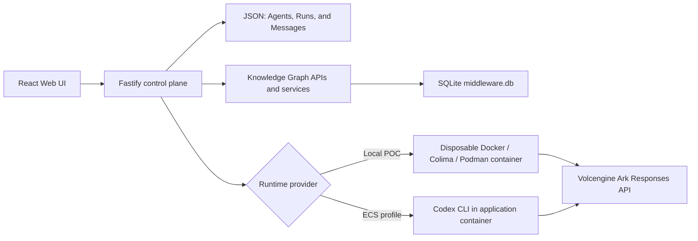

# Volc Agent Launchpad

A minimal Agent platform for three-day middleware hackathons. It provides Agent
CRUD, a browser Playground, persistent workspaces, and Codex CLI backed by the
Volcengine Ark Responses API.

Run it locally with Docker, Colima, or rootless Podman, or deploy it to
Volcengine ECS.

> [!WARNING]
> This is a single-user proof of concept. It intentionally has no identity,
> verified individual identity or hardened sandbox middleware. It includes POC
> policy decisions and audit evidence, but do not use production data or
> credentials. See [SECURITY.md](SECURITY.md).

## Screenshots

### Agent Playground


### Create an Agent


## Features

- React and TypeScript Web UI
- Agent create, edit, start, stop, delete, and multi-turn chat
- Fastify control plane with asynchronous Run state
- Persistent Agent workspaces and Codex sessions
- SQLite-backed Knowledge Graph and governance persistence
- Prompt-assisted access configuration and Agent-scoped learned relationships
- Explainable Blast Radius paths and pre-run allow/review/deny decisions
- Expiring, graph-bound approvals with atomic one-time claims
- Disposable Docker, Colima, or Podman container for each local turn
- Docker and Terraform deployment paths for Volcengine ECS

## Current middleware status and next work

The current implementation is a working **pre-run graph-risk policy
prototype**. It can infer non-authoritative resource relationships from prompt
and final-response text, calculate indirect impact, and prevent Codex from
starting until a risky Run is approved. Direct `CAN_*` permissions are never
silently inferred and still require explicit confirmation.

Two defects found during the full audit are now fixed:

- percent-encoded API paths cannot bypass bearer authentication;
- learned observations are scoped to the Agent that supplied the evidence,
  even when multiple Agents share the same asset node.

The post-fix validation passed 17 test files and 82 tests, both TypeScript
builds, the production Docker build, live Docker authentication probes, and a
compiled SQLite isolation reproduction. The container reached healthy status
on port 3000.

Work should continue in this order:

1. Quarantine unconfirmed prompt observations so a denied or misleading prompt
   cannot immediately influence enforcement.
2. Upgrade and re-audit the vulnerable production dependency chain, especially
   the Fastify/static packages identified in the audit.
3. Route one real protected Agent action through `ResourceGateway` and persist
   ordered attempted, allowed/denied, and completed Run events.
4. Add authenticated human identity, RBAC, and separation between requester
   and approver instead of relying on one shared application token.
5. Add Playwright coverage for the judge flow, approval UI, graph interaction,
   keyboard accessibility, and responsive layouts.
6. Then add Agent-to-Agent delegation, reverse-impact queries, observation
   trust/freshness, and a persistent circuit breaker driven by Run events.

Do not claim full per-tool runtime enforcement, a flight recorder, replay, or
a circuit breaker yet. See the [full audit](docs/FULL_HACKATHON_CODEBASE_AUDIT.md)
and [session implementation report](docs/SESSION_IMPLEMENTATION_REPORT.md) for
the evidence, implementation details, and extended roadmap.

## Requirements

- Node.js 22+
- npm 10+
- Docker, Colima, or Podman
- A Volcengine Ark API key and endpoint that supports the Responses API

Codex CLI is included in the Runtime image and is not required on the host.

## Local browser SOP

### 1. Check the local tools

Install Node.js 22+ and one supported container engine, then verify them:

```bash
node --version
npm --version
docker --version        # Docker Desktop, Docker Engine, or Colima
podman --version        # Use this instead when running Podman
```

Only one container engine is required. Codex CLI is already included in the
Runtime image.

### 2. Clone the repository

```bash
git clone <repository-url> volc-agent-launchpad
cd volc-agent-launchpad
```

Skip this step when already working from the repository root.

### 3. Start the POC

```bash
ARK_API_KEY=your-ark-api-key \
ARK_MODEL=ep-your-endpoint-id \
npm run poc
```

The first run installs Node.js dependencies and builds the Runtime image. The
script automatically selects Docker, Colima, or Podman.

### 4. Open the browser

Visit <http://localhost:3000>, or open it from the terminal:

```bash
open http://localhost:3000       # macOS
xdg-open http://localhost:3000   # Linux desktop
```

In the Web UI:

1. Select **Create Agent**.
2. Enter a name, description, and workspace instructions.
3. Select **Create Agent** again.
4. Enter a task in the Playground, for example:

   ```text
   Create a TypeScript hello-world CLI, add a test, and run it.
   ```

The Agent can write files, run commands, and continue the same Codex session in
later messages.

### 5. Stop and resume

Press `Ctrl+C` in the startup terminal. The script removes temporary Runtime
containers but keeps Agent workspaces and conversations.

- macOS state: `~/.volc-agent-launchpad/`
- Linux state: `.local/`
- Custom location: set `LOCAL_POC_DATA_ROOT`

Run the same `npm run poc` command to continue later.

### Select a specific container engine

Force Podman when multiple engines are installed:

```bash
CONTAINER_ENGINE=podman \
ARK_API_KEY=your-ark-api-key \
ARK_MODEL=ep-your-endpoint-id \
npm run poc
```

Colima uses `CONTAINER_ENGINE=docker` because it exposes the Docker CLI.

For a clean Linux host, follow the
[rootless Podman setup](docs/LOCAL_POC.md#rootless-podman-on-linux).

## Docker Compose

Create and edit the configuration:

```bash
./scripts/bootstrap-local.sh
```

Required values in `.env`:

```dotenv
ARK_API_KEY=your-ark-api-key
ARK_MODEL=ep-your-endpoint-id
APP_AUTH_TOKEN=replace-with-at-least-24-random-characters
```

Start the application:

```bash
docker compose up --build
```

Open <http://localhost:3000>. Stop it without deleting Agent data:

```bash
docker compose down
```

## Development

```bash
npm install
cp .env.example .env
npm install --global @openai/codex@0.111.0
npm run dev
```

- Web UI: <http://localhost:5173>
- API: <http://localhost:3000>

Use local paths in `.env` when running outside Docker:

```dotenv
APP_DATA_DIR=.data
AGENT_WORKSPACE_ROOT=workspaces
CODEX_HOME=codex-home
```

## Deployment

- [Existing Linux ECS with Docker](docs/DEPLOYMENT.md#existing-linux-ecs)
- [Complete Volcengine environment with Terraform](docs/DEPLOYMENT.md#terraform-deployment)
- [Local Docker, Colima, and Podman details](docs/LOCAL_POC.md)

The existing-ECS script deploys from the current source tree:

```bash
cp .env.example .env.production
./scripts/deploy-existing-ecs.sh .env.production
```

The Terraform path provisions VPC, subnet, security group, ECS, and EIP:

```bash
cp deploy/volcengine/terraform.tfvars.example \
  deploy/volcengine/terraform.tfvars
./scripts/deploy-volcengine.sh
```

## Configuration

| Variable | Default | Purpose |
| --- | --- | --- |
| `ARK_API_KEY` | Required | Ark model API key. |
| `ARK_MODEL` | Required | Responses-capable endpoint or model ID. |
| `ARK_BASE_URL` | Beijing v3 endpoint | Ark OpenAI-compatible API URL. |
| `APP_AUTH_TOKEN` | Empty on loopback | Shared demo token; use 24+ random characters remotely. |
| `RUNTIME_PROVIDER` | `local-process` | `container` for disposable local Runtime containers. |
| `CODEX_SANDBOX_MODE` | `workspace-write` | Codex inner sandbox mode. |
| `CODEX_TIMEOUT_MS` | `600000` | Maximum duration of one turn. |
| `APP_DATA_DIR` | `.data` | Parent directory for `launchpad.json` and `middleware.db`. |
| `LOCAL_POC_DATA_ROOT` | Platform-specific | Local metadata, workspace, and session directory. |

See [.env.example](.env.example) for all Runtime and resource-limit options.

## How it works



The first turn uses `codex exec`; later turns resume the stored Codex thread.
Deleting an Agent archives its workspace under `workspaces/.deleted/`.

See [docs/ARCHITECTURE.md](docs/ARCHITECTURE.md) for component and extension
boundaries.

## SQLite middleware database

`middleware.db` is the source of truth for middleware-owned state. The server
opens it through `MiddlewareDatabase` during startup, applies versioned
migrations, and then constructs `SqliteGraphStore`. SQLite keeps the single-node
demo self-contained and requires no hosted database, network connection, or
additional API keys.

Existing platform data and Agent-created files remain separate:

| Location | Responsibility |
| --- | --- |
| `APP_DATA_DIR/launchpad.json` | Agents, Runs, and Messages; legacy graph arrays may remain but are no longer authoritative |
| `APP_DATA_DIR/middleware.db` | Graph facts, migration metadata, policy decisions, approvals, and one-time action claims |
| `AGENT_WORKSPACE_ROOT/{agent-id}/` | Files created in each Agent workspace |

The generated database file is local runtime state and must not be committed.
Commit migrations, seed definitions, store code, and tests so every teammate
can recreate the same schema and demo data. `.gitignore` also excludes SQLite
database, journal, WAL, and shared-memory files.

### Database location by run mode

Always construct the path from `config.dataDirectory`; do not hard-code one of
these locations in application code.

| Run mode | Default host location |
| --- | --- |
| Local `npm run dev` with relative `APP_DATA_DIR=.data` | `apps/server/.data/middleware.db` |
| `npm run poc` on macOS | `~/.volc-agent-launchpad/data/middleware.db` |
| `npm run poc` on Linux | `.local/data/middleware.db` |
| Docker Compose | `data/middleware.db` on the host, mounted as `/app/data/middleware.db` |
| Custom | `$APP_DATA_DIR/middleware.db` |

On a fresh state root, the database file may not exist. SQLite creates it when
the application opens it, and idempotent migrations create or upgrade its
tables.

The optional SQLite CLI can inspect the live database read-only after a local
development start; it is not installed by this project:

```bash
sqlite3 -readonly apps/server/.data/middleware.db
.tables
SELECT id, type, label FROM graph_nodes ORDER BY created_at, id;
.quit
```

Applied migrations are immutable. Never edit, delete, or reorder one: its
checksum intentionally prevents startup if history changes. Add a new migration
with the next higher version instead.

### Persistence boundary

One `MiddlewareDatabase` owns the connection, migrations, transactions, and
shutdown. Focused adapters can share that connection; services and routes must
not query SQLite directly.

```text
KnowledgeGraphService                      PolicyService / Resource Gateway
GraphConfigurationService                         |
          |                                       |
      GraphStore                          GovernanceStore
          |                                       |
  SqliteGraphStore            SqliteGovernanceStore (implemented/tested)
          `-------------------.-------------------'
                              |
                     MiddlewareDatabase
                              |
               APP_DATA_DIR/middleware.db
```

`SqliteGraphStore` implements the existing `GraphStore` contract without
changing `KnowledgeGraphService`, `GraphConfigurationService`, Agent lifecycle,
route shapes, or Playground behavior. `JsonGraphStore` remains only as a legacy
reference adapter. Non-demo graph facts from an old `launchpad.json` are not
automatically imported. Existing Agent identities are reconciled during
startup; the two demo topologies are reconciled only when their demo Agents
exist (development seeds them by default, or set `SEED_DEMO_DATA=true`).

The Impact Map in the Web UI loads the selected Agent's graph and Blast Radius
from the SQLite-backed graph APIs. It redraws when the selected Agent changes,
when that Agent's settings are saved, or when the user selects the refresh
control. Its guided configuration asks for an existing or new asset, the
classification of a new asset, and the Agent's direct access. Risk defaults are
inferred from classification, while reachable assets, downstream paths, and
Blast Radius are inferred from the shared topology. The Network Graph tab reads
`GET /api/graph` and shows all stored nodes and relationships together.
The Impact Map automatically focuses the deterministic shortest evidence route
to the highest-weight protected asset. Its footer explains why that path
was chosen, displays every node and relationship in the route, and lets the
user focus a different scored asset without changing the aggregate score.

The server also learns non-authoritative relationships from explicit statements
in user prompts and completed Agent replies. Learned edges retain their source
Run, evidence excerpt, confidence, and review state. They are drawn as dashed
relationships in the Network Graph and appear in the Impact Map's inline
review queue. Observed or confirmed relationships can conservatively increase
downstream risk; rejected relationships are ignored. This learning path cannot
create `CAN_READ`, `CAN_WRITE`, `CAN_CALL`, or `CAN_USE`, so it can never grant
an Agent access.

The current schema is deliberately split by responsibility:

| Tables | Owner and purpose |
| --- | --- |
| `schema_migrations` | Applied migration versions and immutable checksums |
| `graph_nodes`, `graph_edges` | `SqliteGraphStore`: identities, assets, permissions, impact, and audit facts |
| `graph_observations` | Learned resource relationships with confidence, evidence, Run provenance, and review state |
| `policy_decisions` | `SqliteGovernanceStore`: immutable `ALLOW`, `DENY`, or `REVIEW_REQUIRED` evaluations |
| `approval_requests`, `approval_events` | Pending review state plus append-only approval history |
| `policy_action_claims` | Atomic, single-use permission to execute an already allowed or approved action |

Initialization enables foreign keys, WAL, a five-second busy timeout, migration
checksum verification, refusal of unknown newer schemas, and a foreign-key
integrity check. The adapters use parameterized statements, recursively reject
secret-looking JSON fields, apply strict relation/status/type validation, and
return deterministic query order. Blast Radius counts each reachable asset once
even when multiple capabilities reach the same target.

The server pins `better-sqlite3` as a runtime dependency; keep it under
`dependencies` because production images prune development packages.
Database tests use temporary file-backed databases, never a developer's real
`APP_DATA_DIR/middleware.db`.

See the
[Knowledge Graph MVP specification](docs/KNOWLEDGE_GRAPH_MVP_SPEC.md#sqlite-persistence-foundation)
for the graph contract and reasoning model.

### Authorization and approval boundary

Within the graph, only an exact, direct, authorized `CAN_*` edge from an Agent
to an asset represents a capability. It is necessary but not sufficient for a
future protected action: the gateway must also verify the platform Agent is
live and eligible, the Run belongs to it, and the authenticated actor may make
the request. Ownership, graph reachability, risk scores, previous activity, and
approval history do not create permissions.

The governance store already enforces these persistence rules:

- A stable operation ID is idempotent and is bound to the Run, Agent, action,
  target, and SHA-256 request hash.
- Recording `REVIEW_REQUIRED` atomically creates a pending approval request with
  an expiry; `ALLOW` and `DENY` cannot create one.
- A pending request may become approved, rejected, or expired. For
  `REVIEW_REQUIRED`, only an approved, unexpired review can be claimed;
  `ALLOW` decisions can be claimed directly and `DENY` decisions never can.
- A claim is atomic and single-use. Claiming an approved review also marks its
  request consumed and appends the corresponding approval event. The claim
  must repeat the same operation ID and request hash, preventing an approval
  from being reused for different parameters.
- Transaction callbacks are synchronous and short; they never remain open
  while waiting for a human or an external action.

The `PolicyService` canonicalizes the protected request and computes
its lowercase SHA-256 hash consistently; the store validates and binds that
caller-supplied digest but does not calculate it. It must also verify live-Agent
eligibility and Run ownership before recording a decision. Resolution and claim
times come from the governance store's server-side clock, not request JSON.
There is no expiry worker yet: a caller must record the `expired` transition,
while a late execution claim independently fails closed.

The target protected-action flow is:

```text
ATTEMPTED
  |-- ALLOW --------------------------> execute --------> TOUCHED
  |-- DENY ---------------------------------------------> DENIED
  `-- REVIEW_REQUIRED --> pending human approval
                              |-- approved --> execute -> TOUCHED
                              `-- rejected/expired -----> DENIED
```

> [!IMPORTANT]
> The server now wires policy decisions, approval routes, a pre-run gate, and a
> simulated Resource Gateway. The pre-run gate controls whether Codex starts.
> Arbitrary Codex shell and filesystem operations are still not intercepted per
> tool call, and the demo Resource Gateway does not touch real external systems.

The current shared `APP_AUTH_TOKEN` is an application-level demo token, not a
human identity. Until authenticated operator identity is added, stored actors
must be described as demo operators rather than verified individual approvers.

An Agent or LLM must never write directly to the database or approve its own
request. It may suggest configuration, but only a trusted backend path writes
facts and decisions. Hosts and credential references may be represented as
`asset` nodes, but actual passwords, tokens, API keys, protected payloads, and
other secret values must never be stored in middleware JSON fields.

Deleting an Agent removes it from the live platform but intentionally retains
its graph facts as historical evidence. Graph and relationship API routes first
require the live Agent, so retained facts cannot be queried or extended through
those normal lifecycle endpoints.

## Validation

```bash
npm run check
terraform fmt -check -recursive deploy/volcengine
docker compose config
```

## Documentation

- [Session implementation report](docs/SESSION_IMPLEMENTATION_REPORT.md)
- [Full hackathon codebase audit and remediation status](docs/FULL_HACKATHON_CODEBASE_AUDIT.md)
- [Architecture](docs/ARCHITECTURE.md)
- [Local POC](docs/LOCAL_POC.md)
- [Deployment](docs/DEPLOYMENT.md)
- [Hackathon extension guide](docs/HACKATHON_EXTENSION_GUIDE.md)
- [Knowledge Graph MVP specification](docs/KNOWLEDGE_GRAPH_MVP_SPEC.md)
- [Security policy](SECURITY.md)
- [Contributing](CONTRIBUTING.md)

## License

[MIT](LICENSE)
