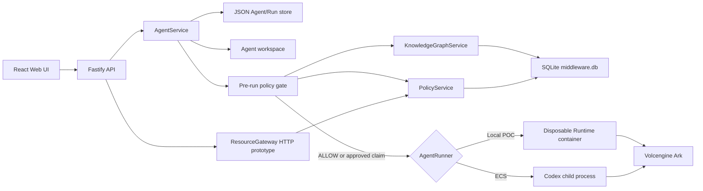

# Architecture

Volc Agent Launchpad is a single-node control plane for hackathon use.



## Components

### Web UI

Lists Agents, manages lifecycle actions, submits prompts, and polls asynchronous
Runs. It never receives the Ark API key.

### Fastify API

Validates requests, protects remote demos with a shared bearer token, and
serves the compiled Web UI. The token is not user identity or authorization.
API protection is determined from Fastify's matched route and a canonical
pathname fallback so percent-encoded API paths cannot skip authentication.

### AgentService

Coordinates lifecycle state, persistence, workspaces, and Runs. One Agent can
have only one active Run. Before the runner starts, it captures deterministic
relationship observations from the prompt and invokes the graph-backed policy
gate. A denied Run fails, a reviewable Run pauses, and an allowed Run reaches
the runtime. Completed Agent text is scanned for additional non-authoritative
relationships.

```text
ready -> busy -> ready
  |       |
  v       v
stopped  error
```

Interrupted Runs become `cancelled` after a restart.

### Storage

```text
data/launchpad.json       Agent, message, and Run metadata
data/middleware.db        Graph, observations, decisions, approvals, claims
workspaces/AgentID/       Agent-created files
workspaces/.deleted/      Archived deleted workspaces
codex-home/               Codex configuration and sessions
```

`JsonStore` serializes writes and atomically replaces one JSON file. It supports
one process only. `middleware.db` uses immutable migrations, foreign keys, WAL,
parameterized queries, and transactions for governance state. The split means
Runs cannot yet be referenced by real SQLite foreign keys.

### Knowledge graph and observations

Direct authorized `CAN_READ`, `CAN_WRITE`, `CAN_CALL`, and `CAN_USE` edges are
the only graph facts that grant capability. They are explicitly configured or
confirmed by an operator. Deterministic text extraction may create resource
nodes and learned dependency observations, but never authority.

Blast Radius starts from an Agent's direct capability and follows trusted
topology plus that Agent's non-rejected observations. SQLite observation
queries filter by both Agent and source node, so an observation learned by one
Agent cannot enter another Agent's traversal through a shared asset.

### Policy and approval

The pre-run gate classifies informational, actionable, and suspicious prompts.
Informational requests can run without action-risk approval; actionable paths
use the graph score; suspicious paths require review unless a stricter denial
already applies. Decisions and approvals are bound to the Run, request, exact
capability/target, and graph revision. Approved claims expire and are single
use.

`ResourceGateway` implements exact protected-action checks and simulated
adapters through HTTP endpoints. Codex tool, shell, filesystem, and network
events are not yet routed through it.

### Runtime providers

- `CodexRunner` runs Codex inside the application container for ECS.
- `ContainerCodexRunner` starts one disposable Docker, Colima, or Podman
  container for every local turn.

Both providers use argv-only process execution, bound output and time, resume
the stored Codex thread, and escalate termination after a grace period.

## Deployment profiles

| Profile | Control plane | Agent execution |
| --- | --- | --- |
| Local POC | Host Node.js | Disposable local container |
| ECS | Application container | Codex process in the same container |
| Local development | Host Node.js | Host Codex process |

## Extension seams

| Track | Primary seam | Expected change |
| --- | --- | --- |
| Glass Box | `AgentRunner`, `AgentRun` | Emit and display correlated execution events. |
| Bouncer | API routes, Agent ownership | Add identity and server-side authorization. |
| Kill Switch | `AgentRunner` | Add threat-specific policy or a stronger sandbox. |

## Current boundary and implementation order

The system currently enforces policy before Codex starts, not around every
operation after startup. It also learns from text claims rather than audited
tool activity. The next implementation order is:

1. quarantine or separately weight unconfirmed observations;
2. remediate the production dependency audit;
3. persist ordered Run events and route one real allowlisted tool through the
   Resource Gateway;
4. add identity/RBAC and requester/approver separation;
5. add browser and accessibility tests;
6. build reverse graph queries, Agent delegation, observation freshness, and a
   persistent circuit breaker on top of the event stream.

Flight recorder, replay, circuit-breaker, and complete runtime-enforcement
claims remain out of scope until those paths exist and are tested.

The current container or ECS instance is the POC trust boundary. Ordinary
containers are not hardened multi-tenant isolation.
