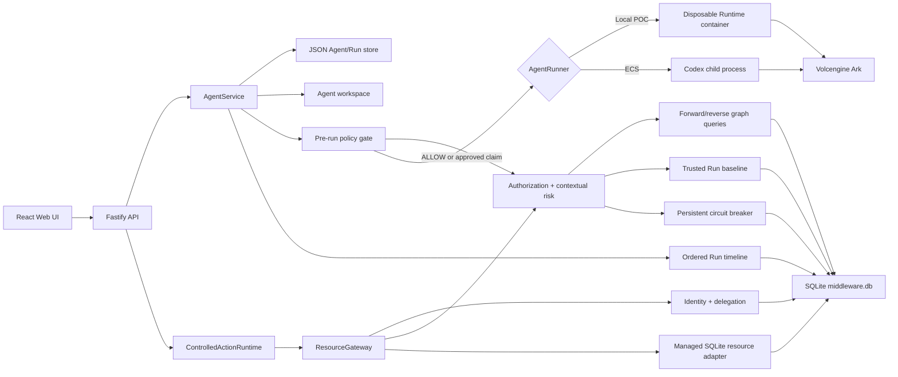

# Architecture

QuantQueens extends the Volc Agent Launchpad into a single-node Agent control
plane plus a narrow, real resource-enforcement boundary. The selected
hackathon track is **Track B — The Bouncer**.



## Components

### Web UI

Lists Agents, manages lifecycle actions, submits prompts, and polls asynchronous
Runs. It never receives the Ark API key.

### Fastify API

Validates requests, protects remote demos with a shared bearer token, and
serves the compiled Web UI. The token is not user identity or authorization.
API protection is determined from Fastify's matched route and a canonical
pathname fallback so percent-encoded API paths cannot skip authentication.
Integrated mutation routes also read the current durable principal: operator
or administrator for normal Agent lifecycle/work, administrator for deletion
and graph authority changes, approver or administrator for reviews, and
administrator for safety-stop reset. A stopped Agent cannot create a protected
execution claim.

### AgentService

Coordinates lifecycle state, persistence, workspaces, and Runs. One Agent can
have only one active Run. Before the runner starts, it captures deterministic
relationship observations from the prompt and invokes the graph-backed policy
gate. A denied Run fails, a reviewable Run pauses, and an allowed Run reaches
the runtime. Completed Agent text is scanned for additional non-authoritative
relationships.

```text
ready -> busy -> ready
  |       |
  v       v
stopped  error
```

Interrupted Runs become `cancelled` after a restart.

### Storage

```text
data/launchpad.json       Agent, message, and Run metadata
data/middleware.db        Graph, timeline, identity, decisions, baselines,
                          breaker, approvals, claims, managed state + receipts
workspaces/AgentID/       Agent-created files
workspaces/.deleted/      Archived deleted workspaces
codex-home/               Codex configuration and sessions
```

`JsonStore` serializes writes and atomically replaces one JSON file. It supports
one process only. `middleware.db` uses immutable migrations, foreign keys, WAL,
parameterized queries, and transactions for governance state. The split means
Runs cannot yet be referenced by real SQLite foreign keys.

### Knowledge graph and observations

Direct authorized `CAN_READ`, `CAN_WRITE`, `CAN_CALL`, and `CAN_USE` edges are
the only graph facts that grant capability. They are explicitly configured or
confirmed by an operator. Deterministic text extraction may create resource
nodes and learned dependency observations, but never authority.

Blast Radius starts from an Agent's direct capability and follows trusted
topology plus that Agent's non-rejected observations. SQLite observation
queries filter by both Agent and source node, so an observation learned by one
Agent cannot enter another Agent's traversal through a shared asset.

### Identity, policy, and approval

Protected requests use the server-attested origin from the Run, not a user ID
from JSON or headers. Configured `OWNS` relationships bind humans to Agents and
mock user resources. RBAC and an exact direct capability are evaluated first;
ownership and delegation can further restrict that authority but never expand
it. An authorization `DENY` ends the path before any adapter effect.

For an authorization `ALLOW`, policy queries the resource's downstream graph,
loads the Agent's versioned trusted-Run baseline, and evaluates deterministic
risk factors. The baseline inspects at most the latest 20 completed Runs in
stable completion-time/ID order and persists the exact window bounds and source
Run IDs; blocked, failed, or unaudited effects never become trusted behavior.
`ALLOW` may execute, `WARN` creates a graph/request-bound approval,
and `BLOCK` trips the persistent breaker. Execution requires an atomic,
single-use claim and then reaches `SqliteManagedResourceAdapter`, which performs
a real durable read or write. Inside the same immediate SQLite transaction as
that read/write, the managed boundary revalidates the exact claim, payload,
correlated authorization and risk decisions, current principal role, full
delegation chain, exact capability/ownership facts, managed-resource binding,
and breaker version. An idempotent effect receipt binds the resulting snapshot
to that exact decision and operation. The Run timeline records the separate
identity, authorization, risk, breaker, claim/effect, and terminal facts. Risk
and breaker events freeze the decision's thresholds, breaker state/version,
graph revision, factors, and bounded baseline window, so later reconstruction
never depends on mutable current state.

The coarse pre-run gate remains for Codex prompts. Its decisions and approvals
are bound to the Run, request, exact capability/target, and graph revision.
Approved claims expire and are single use.

### Runtime feedback loop

```text
MODEL (capabilities + topology + prior baseline)
  -> DECIDE (identity, authorization, graph impact, behavioral risk)
  -> ENFORCE (approval / breaker / one-time claim)
  -> EXECUTE (managed adapter)
  -> OBSERVE (ordered Run events + graph audit edges)
  -> LEARN (trusted completed Runs rebuild a versioned baseline)
  -> UPDATE MODEL (later decisions compare against that baseline)
```

Blocked, denied, failed, or incomplete Runs are excluded from the trusted
normal baseline, so repeating an attack does not teach the middleware that it
is normal.

### Enforced invariants

1. Every managed resource action belongs to one persisted Run, origin human,
   and acting Agent (plus its complete delegation chain when present).
2. A managed adapter is called only after server-side ownership/RBAC, exact
   capability, graph impact, historical risk, breaker, and one-time-claim
   checks succeed.
3. Missing required identity, decision, audit-readiness, graph, or breaker
   evidence fails closed before the effect.
4. An authorization denial, contextual block, unapproved warning, tripped
   breaker, stopped origin/acting Agent, revoked/expired delegation, or stale
   graph/identity binding cannot mutate the managed resource.
5. Delegation is the intersection of the origin role, parent effective scope,
   requested scope, child capability, and configured ownership; it never adds
   authority.
6. Run-local event sequence, not timestamp, defines reconstruction order.
7. Only completed, mediated, authorization-allowed Runs with accepted risk may
   enter the trusted baseline; blocks and failures never become normal.
8. The browser renders backend decisions and persisted evidence. It does not
   calculate authority, risk, blast radius, breaker state, or effect outcome.
9. A managed decision/operation can create at most one durable effect receipt;
   retries return the recorded snapshot and cannot apply a second mutation.
10. A durable role downgrade immediately removes control-plane mutation
    authority; stale process-local identity state does not preserve it.
11. Learning reads and persists a deterministic bounded history window; a Run
    timeline freezes the exact window and breaker version used by its decision.
12. Stopping an Agent first closes admission and drains its protected-action
    leases; once the stop returns, no already-admitted action can create a new
    claim or effect. Only an explicit start reopens admission.

### Runtime providers

- `CodexRunner` runs Codex inside the application container for ECS.
- `ContainerCodexRunner` starts one disposable Docker, Colima, or Podman
  container for every local turn.

Both providers use argv-only process execution, bound output and time, resume
the stored Codex thread, and escalate termination after a grace period.

## Deployment profiles

| Profile | Control plane | Agent execution |
| --- | --- | --- |
| Local POC | Host Node.js | Disposable local container |
| ECS | Application container | Codex process in the same container |
| Local development | Host Node.js | Host Codex process |

## Selected-track proof and extension seams

The selected Track B proof is intentionally deterministic: Alice creates a
fresh Agent, which persists `human:alice -> OWNS -> agent:<new ID>`, and an
administrator grants that Agent one exact read capability to Alice's managed
record. The same server-authenticated Agent Run can read Alice's record and is
denied Bob's by backend ownership/capability policy. Body/header identity
spoofing is ignored. The seeded Release Guardian then demonstrates the deeper
graph/history safety decision through the same enforcement seam; it is not a
claim that multiple hackathon tracks were selected.

## Enforced boundary and honest limitations

The managed-state adapter is the proven action-level boundary. Removing the UI
still leaves a meaningful middleware path: identity and owner checks, exact
capability, graph traversal, history-derived risk, approval/breaker enforcement,
one-time claim, durable adapter effect, and persisted evidence all execute in
the backend.

The timeline supports honest **reconstruction**, not deterministic re-execution
of arbitrary side effects. It preserves execution order, actors, decisions,
resources, delegation, failures, and outcomes. External adapters will require a
transactional outbox and reconciliation before the same recovery guarantees can
be claimed across systems.

Ordinary Codex shell, filesystem, connector, and network operations still do
not transparently pass through `ResourceGateway`. The local disposable Runtime
does not mount `middleware.db`, but the project does not claim a general-purpose
capability sandbox or multi-tenant isolation. Prompt-derived observations are
non-authoritative context and can increase risk; only explicit direct `CAN_*`
edges grant capability.

The current container or ECS instance is the POC trust boundary. Ordinary
containers are not hardened multi-tenant isolation.
