# QuantQueens one-page architecture

> **Submission deliverable:** middleware, data flow, trust boundaries,
> enforcement points, instrumentation, and recovery in one view.

```mermaid
flowchart LR
    subgraph INPUT["UNTRUSTED INPUT"]
        Human["Human operator"]
        Browser["React browser UI"]
        Agent["Agent / tool request"]
    end

    subgraph CONTROL["TRUSTED CONTROL PLANE + MIDDLEWARE"]
        API["Fastify API<br/>schema validation + durable RBAC"]
        Identity["Server-attested identity<br/>human → Agent → Run"]
        PreRun{{"E1 · Pre-run gate<br/>allow / review / deny"}}
        Gateway{{"E2 · Resource Gateway<br/>mandatory pre-effect boundary"}}
        Policy["Authorization + policy<br/>exact capability, ownership,<br/>graph impact, trusted history"]
        Breaker["Approval + circuit breaker<br/>single-use execution claim"]
        Adapter["Managed resource adapter<br/>revalidates before effect"]
        Timeline["I · Ordered Run timeline<br/>decision + effect evidence"]
    end

    subgraph STATE["DURABLE TRUSTED STATE"]
        SQLite[("middleware.db<br/>graph · identity · decisions<br/>approvals · claims · events<br/>baseline · breaker · receipts")]
        Json[("launchpad.json<br/>Agents · Runs · messages")]
        Resource[("Managed resource state")]
        Recovery["R · Recovery / reconstruction<br/>reload evidence · idempotent retry<br/>admin safety-stop reset"]
    end

    subgraph RUNTIME["CONTAINED RUNTIME — NOT AN AUTHORITY SOURCE"]
        Runner["Codex Runtime<br/>local container or ECS process"]
        Workspace["Per-Agent workspace"]
    end

    External["Volcengine Ark<br/>external model service"]

    Human --> Browser --> API
    Agent --> API
    API --> Identity --> PreRun
    API --> Gateway
    PreRun -->|"allowed or approved"| Runner
    PreRun -->|"denied / awaiting review"| Timeline
    Runner <--> Workspace
    Runner <--> External
    Runner -->|"protected action"| Gateway
    Gateway --> Policy --> Breaker
    Breaker -->|"valid one-time claim"| Adapter --> Resource
    Policy -->|"deny / block"| Timeline
    Breaker -->|"review / trip"| Timeline
    Adapter -->|"effect receipt"| Timeline
    API <--> Json
    Identity <--> SQLite
    Policy <--> SQLite
    Breaker <--> SQLite
    Timeline --> SQLite
    Adapter <--> SQLite
    SQLite --> Recovery --> Browser

    classDef enforce fill:#f7e7e3,stroke:#a44437,stroke-width:2px,color:#4f211c;
    classDef evidence fill:#e9f1fb,stroke:#34679a,stroke-width:2px,color:#183a5c;
    classDef durable fill:#edf6ee,stroke:#3f7b50,stroke-width:2px,color:#21452b;
    class PreRun,Gateway enforce;
    class Timeline evidence;
    class SQLite,Resource,Recovery durable;
```

| Marker | What it proves |
| --- | --- |
| **E1** | A risky or suspicious Agent Run can pause before Codex starts. |
| **E2** | A managed resource cannot change without server identity, exact permission, contextual safety, breaker, and a one-time claim. |
| **I** | Every decision and real effect outcome receives ordered, durable evidence. |
| **R** | Persisted evidence survives reload; receipts make retries idempotent, and an administrator can reset a reviewed safety stop without bypassing authorization. |

**Trust claim:** the browser, prompt, Agent output, request-body identity, and
runtime are not authority sources. Only the trusted backend can create graph
authority, approve an action, issue an execution claim, or invoke the managed
adapter. Ordinary Codex shell, filesystem, and network operations are outside
the current `ResourceGateway` guarantee.
