# QuantQueens one-page architecture

> **What this proves:** exact permission can pass while graph impact and trusted
> Run history still stop a managed effect. The pre-effect guarantee below is
> deliberately limited to managed SQLite resources, not arbitrary Codex tools.

```mermaid
flowchart LR
    subgraph OUTSIDE["UNTRUSTED OR NON-AUTHORITY INPUT"]
        Human["Human operator"]
        Browser["React browser<br/>prompt + controls"]
        Runtime["Codex runtime<br/>read-only sandbox for protected planning"]
        Ark["Volcengine Ark"]
        Workspace["Per-Agent workspace"]
    end

    subgraph CONTROL["TRUSTED APPLICATION AND MIDDLEWARE"]
        API["Fastify API<br/>authentication + validation"]
        Runs["AgentService<br/>normal prompt Run lifecycle"]
        ManagedRun["ControlledActionRuntime + AgentService<br/>create attributable managed-action Run"]
        E1{{"E1 · whole-Run gate<br/>allow · pause · deny"}}
        Validate["Validate one model proposal<br/>against current managed catalog"]
        E2{{"E2 · ResourceGateway<br/>managed-action gate"}}
        Identity["Server-attested Run identity<br/>origin + Run + Agent + delegation"]
        Auth{{"Exact authorization<br/>owner + RBAC + direct CAN_*"}}
        Impact["Backend reverse graph<br/>production impact = 5 resources<br/>includes sensitive customer-data path"]
        History["Trusted Run baseline<br/>normal staging max = 3<br/>production target is novel"]
        Risk{{"Graph + history risk<br/>ALLOW · WARN · BLOCK<br/>persistent breaker state"}}
        Pause["Pause for bound approval<br/>no claim yet"]
        Claim["Atomic one-time<br/>execution claim"]
        Prevent["PREVENTED<br/>no execution claim<br/>adapter not called<br/>managed state unchanged"]
        Events["I · ordered Run timeline<br/>request · identity · authorization<br/>risk · breaker · effect outcome"]
        Recover["R · controlled recovery<br/>reload/restart evidence<br/>audited breaker reset<br/>exact adapter repeat cannot mutate twice"]
    end

    subgraph EFFECT["PROVEN EFFECT BOUNDARY: MANAGED SQLITE ONLY"]
        Adapter["SqliteManagedResourceAdapter<br/>rechecks exact authority,<br/>payload, breaker, and claim"]
        Managed[("managed_resource_state<br/>+ bound action receipt<br/>one SQLite transaction")]
    end

    subgraph STATE["DURABLE STATE"]
        Json[("launchpad.json<br/>Agents · Runs · messages")]
        DB[("middleware.db<br/>graph · identity · decisions · events<br/>baseline · breaker · claims")]
    end

    Human --> Browser --> API
    API -->|"normal prompt: create Run"| Runs --> E1
    Runs --> Json
    API -->|"managed route: create managed-action Run"| ManagedRun --> E2
    ManagedRun --> Json
    API -->|"existing Run: direct action route"| E2
    E1 -->|"allow / approved"| Runtime
    E1 -->|"pause / deny"| Events
    Runtime <--> Ark
    Runtime <--> Workspace
    Runtime -->|"bounded untrusted proposal"| Validate --> E2
    E2 --> Identity --> Auth
    Auth -->|"DENY"| Prevent
    Auth -->|"ALLOW: CAN_WRITE unchanged"| Impact --> History --> Risk
    Risk -->|"presenter: WARN, deny threshold 80"| Pause
    Risk -->|"hard-stop: BLOCK at deny threshold 40"| Prevent
    Pause -->|"approved and still valid"| Claim
    Pause -->|"rejected / expired"| Prevent
    Risk -->|"ALLOW"| Claim
    Claim -->|"valid claim"| Adapter --> Managed

    Identity -. "persist fact" .-> Events
    Auth -. "persist decision" .-> Events
    Risk -. "persist factors + transition" .-> Events
    Adapter -. "completion / failure" .-> Events
    Prevent --> Events --> DB
    Identity <--> DB
    Impact <--> DB
    History <--> DB
    Risk <--> DB
    Claim <--> DB
    Managed --- DB
    Json --> Recover
    DB --> Recover --> API

    classDef enforce fill:#f7e7e3,stroke:#a44437,stroke-width:2px,color:#4f211c;
    classDef evidence fill:#e9f1fb,stroke:#34679a,stroke-width:2px,color:#183a5c;
    classDef durable fill:#edf6ee,stroke:#3f7b50,stroke-width:2px,color:#21452b;
    classDef stopped fill:#fff1cf,stroke:#8a5b00,stroke-width:3px,color:#4d3400;
    class E1,E2,Auth,Risk,Claim enforce;
    class Events evidence;
    class Json,DB,Managed,Recover durable;
    class Prevent stopped;
```

| Marker | Runtime meaning |
| --- | --- |
| **E1** | The coarse gate can stop Codex execution before the runner starts. A protected-resource prompt reaches Codex only as a read-only planning turn. |
| **E2** | This is the exact managed-action boundary. Identity and direct capability run first. Graph impact, trusted history, configured thresholds, and the persistent breaker then decide whether an authorized action pauses or stops. Missing required context fails closed. |
| **I** | Immutable, strictly sequenced events record separate authorization, risk, breaker, and effect facts. The UI explains this persisted evidence; it does not make the decision. |
| **R** | Reload and restart reconstruct the evidence. An admin reset is an audited Run that reopens evaluation but does not approve the blocked action. Gateway claims stay single-use. An exact repeated adapter invocation for the same already-claimed action cannot mutate twice; this is adapter idempotence, not Run replay. |

**Why this is more than RBAC.** Release Guardian keeps direct
`CAN_WRITE` permission to Deployment configuration, so authorization returns
`ALLOW`. The backend graph finds five potentially affected resources and a
sensitive customer-data path. Trusted staging Runs establish a normal maximum
of three resources, making production both larger and novel. In the presenter
profile, `POLICY_DENY_THRESHOLD=80` returns `WARN`: the action pauses with no
claim or adapter call until a bound approval is consumed. In the integrated
hard-stop profile, `POLICY_DENY_THRESHOLD=40` returns `BLOCK`: the breaker
becomes `TRIPPED`, no claim is created, the adapter is not called, and the
durable configuration stays unchanged. Both outcomes use the same `ALLOW`
authorization; only the configured risk threshold differs.

**Trust boundary.** The browser, prompt, request-body identity, model proposal,
and Runtime output are not authority sources. The model proposes at most one
catalog action. Only the server resolves identity, verifies ownership and exact
capability, computes graph and history evidence, changes breaker state, issues
a claim, and constructs the managed adapter.

**Recovery and limits.** Managed state and its receipt commit atomically.
Post-effect graph or timeline finalization can still fail; the server reports
that the effect happened and needs audit repair instead of calling it blocked.
External adapters still need a transactional outbox and reconciliation
protocol. Ordinary Codex shell, filesystem, connector, and network actions
remain outside `ResourceGateway`.
